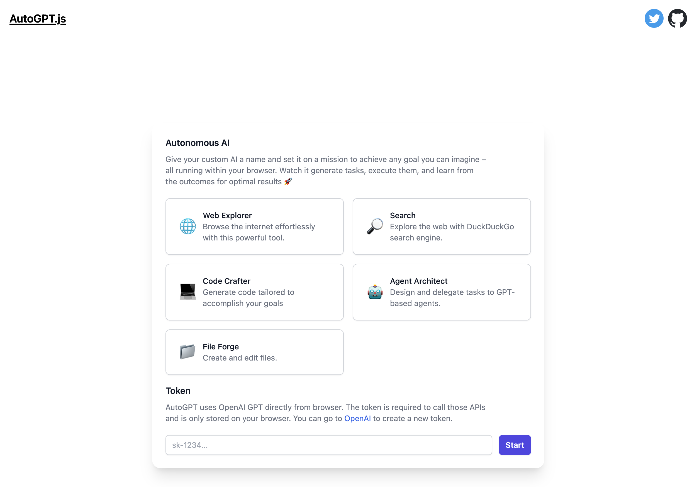

# AutoGPT.js

Visit [AutoGPTjs.com](https://autogptjs.com)

The Auto-GPT [commit: 4839a0d89b2ac6569ab0eeb07e72506c97385b47] inspired browser version to make it more accessible for people to run.

;

## Development

1. Copy `.env.example` to `.env` and change as necessary.
2. Run `npm install` to get all the dependencies.
3. Run `npm run dev` to start the development server.